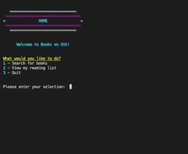

<h1 align="center">Books on 8th</h1>

<div>
<p align="center"> A command line application utilizing Google Books API. <br> 
Allows user to search for books and save selections to a reading list.
</p>

<p align="center">
  <a href="" rel="noopener">
  </a></br>
</p>
</div>

## Table of Contents

- [Getting Started](#getting_started)
- [Testing](#testing)
- [Usage](#usage)
- [Process](#process)
  - [Day One](#day-one)
  - [Day Two](#day-two)
  - [Day Three](#day-three)
  - [Day Four](#day-four)
- [Future Implementation](#future)
- [Author](#author)
- [Acknowledgments](#acknowledgments)


## Getting Started <a name = "getting_started"></a>

These instructions will get you a copy of the project up and running on your local machine for development and testing purposes. 

### Prerequisites 

What things you need to install the software and how to install them.

```
Give examples
```

### Installing 

A step by step series of examples that tell you how to get a development env running.

Say what the step will be

```
Give the example
```

And repeat

```
until finished
```

End with an example of getting some data out of the system or using it for a little demo.

## Testing <a name = "testing"></a>

Explain how to run the automated tests for this system.

### Break down into end to end tests

Explain what these tests test and why

```
Give an example
```

### And coding style tests

Explain what these tests test and why

```
Give an example
```

## Usage <a name="usage"></a>

Add notes about how to use the system.

## Process <a name = "process"></a>

I decided to build this app in my weaker language of the two that I practice so far. I've just graduated a bootcamp concentrating on JavaScript & JS frameworks, so I thought this would be a great opportunity to refresh my novice/rusty Python skills and demonstrate my range as a developer.

I had a lot of research to do! Since I'm self-taught in Python, this project required quite a few skills that I'd never attempted in this language (such as sending api calls & writing tests). 

I wanted to avoid relying on libraries, apart from built-in modules and those explicitly permitted in the instructions (which stated we could use libraries to parse JSON & send API requests). 

Before I got started, I spent half a day researching approaches to building Python CLI's. Many examples I found relied heavily on dependencies, until I found a blog about building a simple command line weather forecaster. I built <a href='github.com/fifikim/weather-cli'>this weather app</a> to get a sense of my process and then went to work on this Books CLI.

### Day One <a name = "day-one"></a>
- Goals:
  - Create kanban board with user stories to guide feature implementation
  - Pseudocode a skeleton of the app & then write each function

- Wins: 
  - ✅ Built a working (buggy) version of the full program with decent UI. 
  - ✅ Figured out how to save reading list to a local json file so that data persists after app exits.

- Blockers:
  - 👻 Python feeling very foreign & I'm fighting constant urge to hit the semicolon key.
  - ❓ Have never written a test in Python (only Mocha/Chai for JS) - need to research tomorrow.
  - ❓ Unsure how to handle invalid menu selections & queries.

### Day Two <a name = "day-two"></a>
- Goals:
  - Work on blockers from yesterday - testing, special characters
  - Improve UX: app should only exit when user decides to quit 
  - Look into ways to reduce coupling: ORM/encapsulation
  - Modularize components for reusability & SOC 
  - Break apart fns that aren't following SRP
  - Create classes -- whoops!!!! Edit book & menu fns to use classes & class methods

- Wins:
  - ✅ Code feels much less redundant after creating classes & methods.
  - ✅ Better user flow, fewer unexpected terminations/dead ends.
  - ✅ Took some effort but was able to convert reading list & search results back and forth from JSON format to a list of Book class instances.

- Blockers:
  - ⏳ Took a long time to switch from functional to OOP mindset. Not sure that I'm there yet.
  - ❓ Unsure how to let user cancel out of input prompt without exiting program.
  - 😨 Wasn't able to start testing today -- more research needed on this topic.

### Day Three <a name = "day-three"></a>
- Goals:
  - Create tests
  - Implement try/except blocks to catch invalid user input
  - Keep looking for ways to DRY code, separate concerns, & decouple components

- Wins:
  - ✅ Refactored code to remove all global variables 
  - ✅ Validation handles invalid/blank input for menu selection & search queries
  - ✅ Learned how to color output to the terminal w/o using additional libraries. Happier with UI.
  - ✅ Created tests to check fns that return 

- Blockers:
  - ❓ Not sure yet how to write tests that check terminal output - need to read up on unittest.mock
  - ❓ Realized that program won't run on Python 2, I think due to use of f-strings. Could convert all formatting to use string concatenation, but want to research building executable stand-alone apps to run on Mac/Unix & Windows. 

### Day Four <a name = "day-four"></a>
- Goals:
  - Create tests that mock print() and input()
  - Figure out how to turn script into executable stand-alone app
  - Finish README file w/ preview gif & installation instructions

- Wins:

- Blockers:

## Future Implementation <a name = "future"></a>

- let user cancel a search or save
- add hidden id key to books to prevent saving duplicate entries in reading list

## Author <a name = "author"></a>

Sophia Kim <br/>
mail@fifikim.com <br/>
<a href="linkedin.com/in/fifikim">LinkedIn</a> <br/>

## Acknowledgements <a name = "acknowledgements"></a>

Books and online references:
- Clean Python, Sunil Kapil, Apress
- Python Cookbook, David Beazley & Brian K. Jones, O'Reilly
- Unittest: 
  https://docs.python.org/3/library/unittest.html
- More on testing:
  https://www.codecademy.com/courses/learn-intermediate-python-3/lessons/int-python-unit-testing/ (subscription required)
- Coloring Output: 
  https://stackabuse.com/how-to-print-colored-text-in-python/
- Basic example of Python CLI fetching API data: 
  https://python.plainenglish.io/writing-my-first-command-line-tool-part-1-of-2-71e30d68402c
- Encoding/Decoding JSON <==> Custom Python Objects:
  https://realpython.com/python-json/
